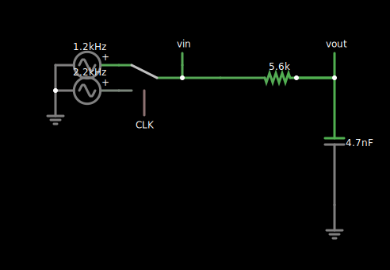
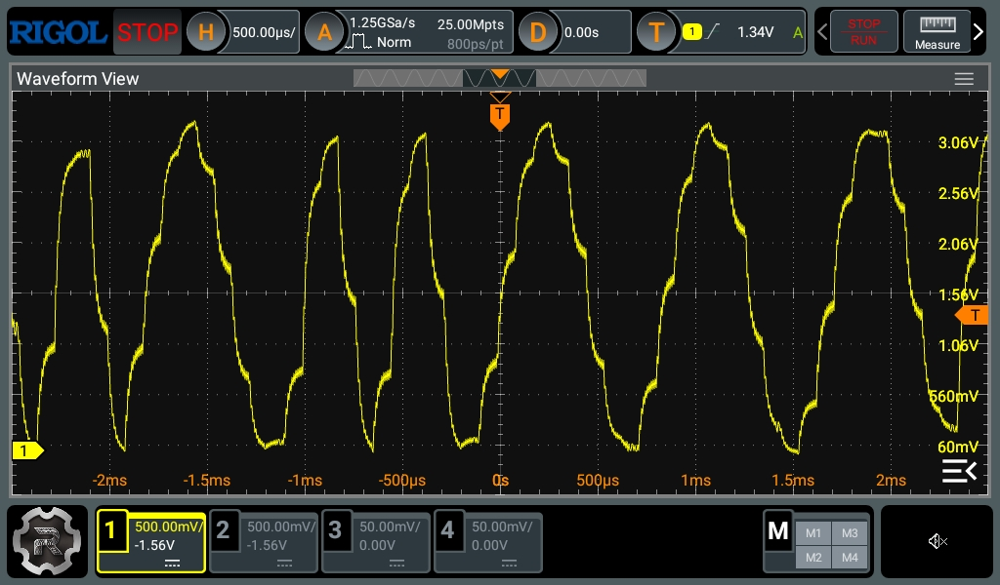

# 〰️ ESP32S3 Digital to Analog Considersations

The ESP32S3 is full of built-in features from bluetooth to USB, but surprisingly lacks a DAC!  Some ESP32 skus have an [I2S to internal DAC](https://docs.espressif.com/projects/esp-idf/en/v4.4.1/esp32/api-reference/peripherals/i2s.html#configuring-i2s-to-use-internal-dac-for-analog-output) which sounds like a great feature, but unfortunately, not only does the ESP32S3 version no have it, this feature is deprecated... bummer.

The recommended way forward is to either use the PWM (their LEDC peripheral) or [Sigma-Delta output, either way you low pass filter the output to generate the output level](https://github.com/espressif/esp-idf/tree/b4268c874a4cf8fcf7c0c4153cffb76ad2ddda4e/examples/peripherals/sigma_delta/sdm_dac).  

Here we choose the PWM route simply because Micropython already has PWM support for the ESP32S3 target.  

### Input/Output Filters

#### Output filter
As the PWM is digital, and output LPF, where $` R = 5.6k Ohm `$ and $` C = 47n F `$.  That gives about a 600Hz cutoff covering $`f_{mark} = 1200Hz`$ and $`f_{space} = 2200Hz`$.

[Click here to visit CircuitJs simulation](https://www.falstad.com/circuit/circuitjs.html?ctz=CQAgjCAMB0l3BWc0DscBMkDMBOHAWOAydEBSMsihAUwFowwAoAcxEIq03bhCwVIVITAE4h0CAGzhJFDjKFlZwgMY8KYWer7d87VPENHIYejmQo86fCgnWw+BAA5BsE1CaYU4yE-D49TD9GUj0ANwBLADtPSG95TTleEPYQMIB7AFcAFyYAdz4BBW1EjwKg4oqHPWFy30qpYuEAJWKwFGlS9GtwcXFyPnFoJCFhpi760rB0YK1SbjBjQyGEJjD2YIDwGf8a3unk4eQRqDH1-GCO7cvpDXFMDSOwI9HVtgvwK4+KoXyNz+kH2qHnSqQgGm6OD86GgeBwKFs6HaJnwOGctzc7gopCwHiAA)
<br>


### DMA-like output at fixed frequency

Some micropython ports include a function ```write_timed``` which ["Initiates a burst of RAM to DAC using a DMA transfer"](https://docs.micropython.org/en/latest/library/pyb.DAC.html) We again do not have this function built-in functionality with the ESP32S3 port.  Fortunately, this functionality is easy to implement with good old fashion timers and interrupts as is done in the [```out_afsk```](https://github.com/stephanelsmith/micro-aprs/blob/4d8d3656e38deeb139f631df4da73836a0c2befc/src/upy/afsk.py#L9) function.

### AFSK Output rate comparison
AFSK sampling rates from 11k to 44k all functional for creating demodulatable signal.  One consideration I noticed was at 44.1kHz, the microcontroller was periodically having issues keeping up.  Recommendation going with 22kHz or even 11kHz depending on application and timing margin needed.

#### 44.1kHz


#### 22.05kHz


#### 11.025kHz



## :raised_hands: Acknowledgements
- [Digikey RC passfilter calculator](https://www.digikey.com/en/resources/conversion-calculators/conversion-calculator-low-pass-and-high-pass-filter)
- [E32-S3 no DAC - No Problem! We'll Use PDM](https://www.atomic14.com/2024/01/05/esp32-s3-no-pins.html#:~:text=So%2C%20there's%20no%20DAC%20on,and%20use%20an%20analog%20amplifier.)
- [ESP32-S3 howto ADC and DAC](https://github.com/nakhonthai/ESP32APRS_T-TWR/tree/main/doc)


